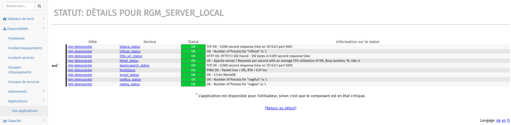
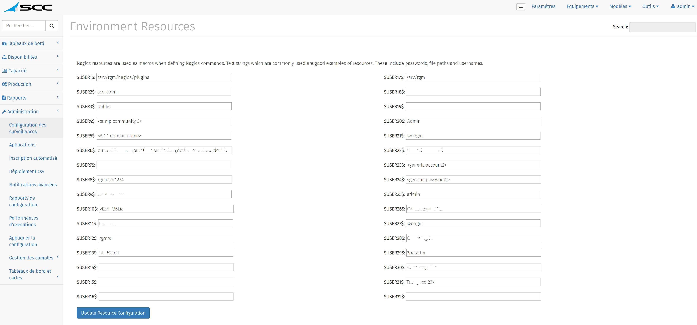
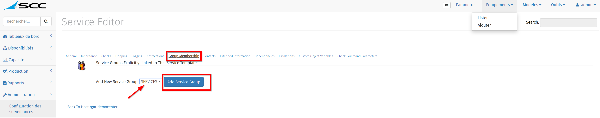
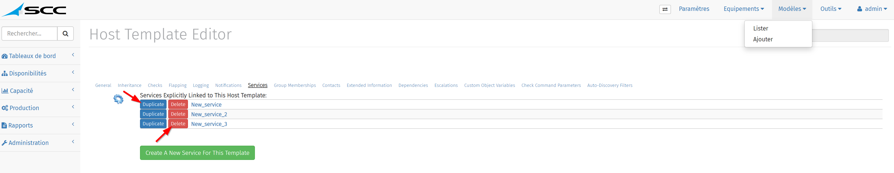
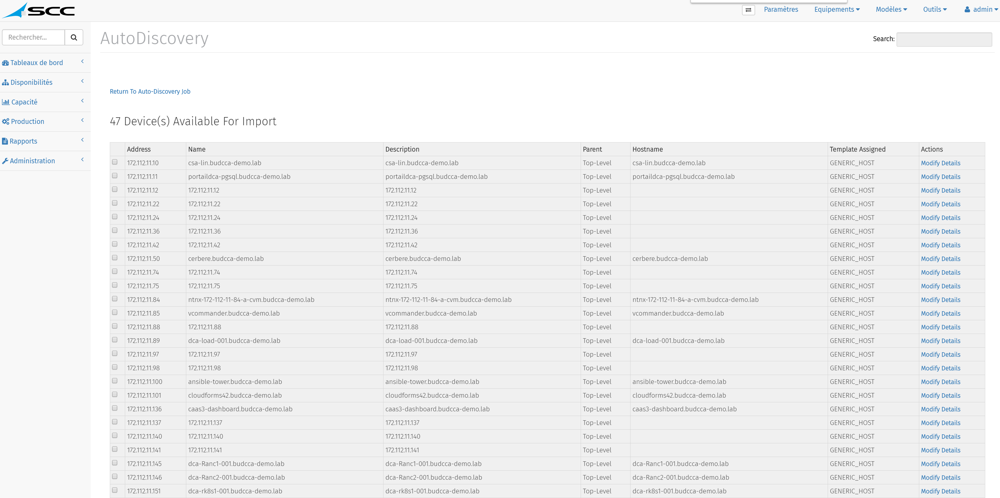
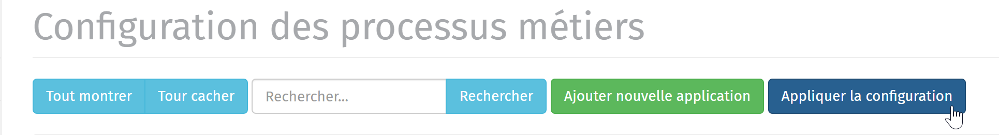
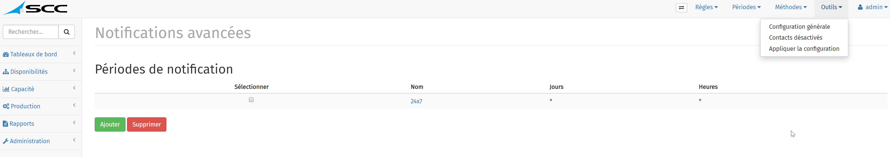
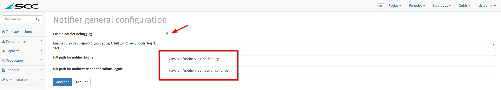
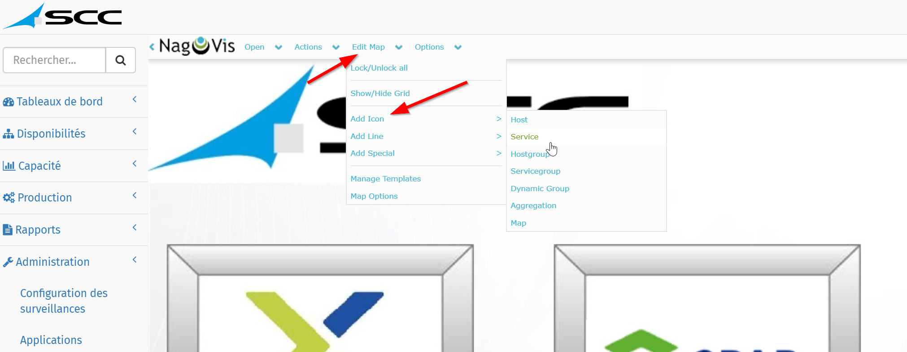

 

 

 

 

 

 

 

#    I.     Description du document

## **Objectif du document**

*Ce document permet aux administrateurs Système et Réseaux la mise en œuvre de la solution d’Hypervision RGM.*

## Destination du document

*Ce document s’adresse toutes personnes souhaitant utiliser la solution « RGM » pour superviser leurs infrastructures SI et métiers.*

## Modification du document

| Date       | Révision | Propriétaire   | Résumé           |
| ---------- | -------- | -------------- | ---------------- |
| 26/03/2020 | V0R1     | Communauté RGM | Version initiale |

#    **II.**      Qu’est-ce que « RGM »

La solution RGM a pour vocation de détecter les incidents, mais aussi de les anticiper pour éviter tout arrêt de service. 

 

L’outil permet de surveiller par une scrutation régulière l’état des équipements réseau, des systèmes ainsi que des applications et services d’infrastructures (DNS, Serveur Web, Serveur de Messagerie, etc.). La disponibilité des services est représentée par équipement surveillé ou par groupes d’équipements. 

 

L’état des hôtes et des services supervisés peut faire l’objet d’alerte par mail, SMS ou autres modélisés suivant des règles de notifications construites en conformité des processus ou suite à l’étude des workflows de l’entreprise. 

L’infrastructure cible est surveillée grâce à des « plug-ins » exécutés régulièrement par RGM. Chaque plug-in est spécialisé dans la surveillance d’un élément particulier du S.I. 

Les informations collectées sont ensuite stockées en base de données et présentées sur l’interface Web de RGM sous forme de cartographie. 

La cartographie représente une vue logique du réseau surveillé ainsi que les équipements défaillants. Une double visualisation au niveau de la cartographie permet de connaître l’état des services d’un équipement et de savoir si l’équipement est « Up » ou « Down ». 

L’Appliance RGM, construite autour d’une pile Automation/Elastic/Nagios/Grafana ce qui fait de RGM une plateforme d’Hypervision qui réunit et simplifie la mise en oeuvre des logiciels libres les plus pertinents pour piloter les architectures : Legacy, Cloud et Serverless. 

 

RGM est agnostique et flexible. La solution se concentre sur la gestion des versions et sur le cycle de vie des données : 

- Gestion simplifiée de la découverte des équipements via API

- Les indicateurs collectés sont découverts au fur et à mesure qu’ils sont remontés sans avoir besoin de les déclarer préalablement 

- Garantir le bon fonctionnement d’une application via l’agrégat et la corrélation des points de surveillance 

  

RGM permet de répondre aux paradigmes suivants : 

- Découverte des métriques au fil de l’eau. Les indicateurs collectés sont découverts au fur et à mesure qu’ils sont remontés sans avoir besoin de les déclarer. 
- Webisation des composants. De plus en plus de composants exposent une interface HTTP (IHM ou API). 
- Cycles de vie courts. Les indicateurs et les composants qui les portent ont des vies très courtes, liées notamment aux déploiements des conteneurs, aux redimensionnements des pools. Reconfigurer le monitoring doit se faire à chaud et très fréquemment. 
- Vision dynamique. Les systèmes de monitoring doivent avoir la capacité à s’intégrer avec des systèmes d’auto-découverte pour s’adapter en permanence aux évolutions de la topologie d’infrastructure. 
- Vision distribuée d’éléments constitués de plusieurs indicateurs. Avoir une vraie garantie du bon fonctionnement d’un service ne peut pas nécessairement se déterminer en regardant localement l’état d’une machine ou d’un processus. Il est parfois nécessaire d’agréger ou corréler des remontées de plusieurs machines. 

Des Tableaux de bord sont proposés et modulables pour l’ensemble des acteurs de la DSI : Techniques, Capacitifs, Applicatifs et Métiers… Cela permet de donner de la visibilité sur l’infrastructure « On-permise et Cloud ». 

Les indicateurs tels que CPU, RAM, DISK vont permettre de gérer le « Capacity planning » et d’anticiper les incidents relatifs à la plateforme. Les ajouts de métriques permettent de mesurer la performance réseau.

**Composants disponibles dans la solution :**

| Briques logiciels | Fonctionnalités                                              |
| ----------------- | ------------------------------------------------------------ |
| rgmweb            | Interface d'administration                                   |
| thruk             | Interface de monitoring (Disponibilité)                      |
| nagios            | Ordonnanceur  de checks                                      |
| nagvis            | Outil de  visualisation des données Nagios                   |
| ged               | Bus  évènementiel                                            |
| nagiosBP          | Outil de  modélisation des applications                      |
| grafana           | Outil de  visualisation et de mise en forme de données métriques |
| mk-livestatus     | Outil  d'accès au moteur Nagios sans accès disque            |
| elasticsearch     | Outil  d'analyse et indexation des données                   |
| kibana            | Outil de  visualisation des données Elasticsearch            |
| beats-oss         | Agent  open source de transfert pour les indicateurs         |
| histou            | Outil  d'ajout de Templates Grafana                          |
| influxDB          | Base de  données Time series                                 |
| mariaDB           | Base de  données MySQL                                       |
| lilac             | Outil de  configuration graphique pour Nagios                |
| nagflux           | Connecteur  de données de performance                        |
| notifier          | Module  de notifications avancées                            |
| nrdp              | Protocole  de transport pour les données Nagios              |
| rgmapi            | API RGM                                                      |
| ansible           | Outil de  management des configuration                       |
| snmptt            | Outil de  capture et traduction des traps SNMP               |
| mod_auth_rgm      | Module  d'authentification pour RGM                          |
| nrpe              | Moteur des agents Nagios pour exécution des scripts locaux   |
| mod_gearman       | Module  pour architecture RGM distribuée                     |
| apache            | Serveur  Web                                                 |

L’ensemble des services ne seront pas abordés dans ce document.

**Rappel de compétences :**

Sous RGM, l’utilisateur ayant tous les droits est appelé « rgm ». 

Pour disposer de ses droits, il convient de se loguer en tant que « rgm » sur la machine.

**Toutes les commandes** sont donc exécutées en « rgm » ou avec un utilisateur ayant ses droits. 

 

Les principaux répertoires RGM sont : 

/etc Contient les fichiers de configuration de bases 

/srv/rgm Contient les fichiers relatifs à la solution RGM 

/usr Contient les fichiers utilisateurs

#    **III.**      Installation de la solution « RGM »

Pour l'installation de la solution « RGM », se référer au chapitre d'installation.

#    **IV.**      Accès à l'interface « RGMWEB »

## 1. Accès à l'interface Web

Pour accéder à l’interface web, il convient de saisir l’url du serveur web dans un navigateur :

[https://nom_du_serveur/login.php##](https://nom_du_serveur/login.php)

Le login par défaut pour accéder à l’interface est « admin:admin »

## 2. Présentation des menus

La solution se décline sous 6 menus principaux :

### a. Tableau de bord

Le menu « Tableaux de bord » propose l’accès à différentes visualisations :  Vue synthétique du SI, Topologie réseau, Cartes Nagvis et performance Grafana.

*Vue synthétique du SI*

Sur le tableau de bord, il y a 4 types de diagrammes, circulaires et en barre : 

- Celui en haut à gauche représente l’état des équipements « UP/DOWN »
- Celui en haut à droite symbolise les services « CRITICAL/WARNING/UNKNOWN et PENDING » 
- Les 2 graphiques en bas proposent les messages d’erreurs en cours, dénommés « évènements actifs » selon leurs niveaux de criticité.

*Topologie réseau*

Cette cartographie permet une visualisation circulaire ou tabulaire avec divers regroupements (équipements, services, adresses IP…).

*Cartes Nagvis*

Les cartes Nagvis, souples et modulables, permettent de générer des vues métiers issus de la supervision.

*Performance - Grafana* 

Grafana permet de générer des tableaux de bord sur la base de métriques et données temporelles. Il est orienté « data visualisation ».

### b. Disponibilités

*Problèmes*

La vue Problèmes permet de visualiser les pannes en cours. Cette vue se décompose en deux sous-menus « Incidents équipements » et « Incidents services » pour une meilleure visualisation.

*Incident équipements*

*Incident services*

*Groupes d’équipements*

La vue « Groupes d’équipements » permet de trier et classer les équipements par technologie, type ou modèle. Ces regroupements sont utilisés notamment pour limiter les vues de certains utilisateurs. 

*Groupes de services*

La vue « Groupe de services » est similaire à la précédente, et permet également de limiter les vues utilisateurs à certains services spécifiques.

*Évènements*

La vue « Evènements » permet la visualisation des événements actifs et résolus.

Affichage des évènements en cours avec l’état et le descriptif associé. 

Il est possible d’interagir sur les événements via la prise en compte ou l’acquittement par exemple et d’afficher plus de détails.

*Applications*

La vue Application fournit un résumé des vues métiers disponibles et du service rendu à l’utilisateur final.

L’icône « Tree » permet de visualiser l’ensemble des services qui sont utilisés pour modéliser l’application. 

### c. Capacité

*Performance*

Ce menu permet la visualisation graphique des services par équipements sur une période donnée.

### d. Production

*Arrêts planifiés/récurrents*

Ce menu permet de suspendre temporairement la supervision sur un ou plusieurs équipements et ces services sur une période donnée. 

Il également possible de définir des plages de maintenance récurrentes dans le cadre de campagnes de mises à jour par exemple.

### e. Rapports

*Génération de rapports*

Ce menu permet de générer automatiquement des rapports de disponibilité des équipements et des services. L’envoi des rapports par mail est possible sous réserve d’une configuration préalable.

Il peuvent être également consultés immédiatement en HTML ou PDF.

*Évènements*

Le sous-menu « Evènements » permet de visualiser les volumes d’incidents sur une période donnée et SLA technique avec les temps moyens de résolution.

*Disponibilité*

Le menu disponibilité permet de générer à la volée des rapports de disponibilité, tendances et résumés sur une période donnée sur différents critères (groupe d’équipements, services…).

### f. Administration

Ce menu permet la configuration complète de la solution RGM, il sera donc détaillé plus en profondeur dans le chapitre suivant « Paramétrage de la solution ».

#    V.      Paramétrage de la solution « RGM »

**L’Appliance** **RGM** est construite autour d’une pile Automation/Elastic/Nagios/Grafana et un ensemble de composants pour répondre aux besoins d’Hypervision. 

## 1. Configuration des surveillances - Paramètres

### a. Nagios Daemon Configuration 

Ce menu est utilisé pour la configuration globale du composant « Nagios » : Les paths, les valeurs de rétention et intervalles d’interrogation des points de contrôles, etc…

Les valeurs par défaut sont optimales pour une utilisation classique de la solution RGM.

### b. Nagios Web Interface Configuration

Ce menu permet d’interagir sur la configuration globale de l’interface Web.

Les valeurs par défaut sont optimales pour une utilisation classique de la solution RGM.

### c. Nagios Ressources

Ce menu permet de paramétrer un ensemble de variables d’environnement, appelé « Ressources », nécessaires à l’exécution des points de contrôles. Par exemple :

**$USER1$** : Correspond au chemin absolu du répertoire RGM contenant les scripts.

**$USER2$ - $USER4$** : Représente la communauté SNMP utilisée pour les tests.

**$USER5-$USER6$** : Utilisé pour définir des comptes de domaine Active Directory.

 

L’ensemble des autres Ressources peuvent être utilisées pour définir des comptes d’accès à des équipements ou n’importes quelle autre variable d’environnement.

 

Pour ajouter une ressource, entrez une valeur dans le champs d’une des ressources vides disponibles, puis cliquez sur « Update Ressource Configuration ». 

Par exemple, la ressource qui contient la communauté « public » sera disponible sous la macro « **$USER3$** ».

### d. Nagios Commands

Ce menu permet de créer de nouvelles commandes d’exécution pour les points de contrôle. 

 

Préalablement, le plugin doit être disponible dans le répertoire « /srv/rgm/nagios/plugins/rgm/xxxxx ». Pour plus de lisibilité, des sous répertoires par type d’équipements sont existants (ex : database, storage, etc…).

Créer ou déplacer votre plugin dans le répertoire dédié via SCP ou SFTP, puis définir les droits et attributs suivants : 

Lorsque le plugin est disponible dans l’arborescence, pour créer une nouvelle commande, cliquez sur « Add A New Command ».

Définir un nom dans le champ « Command Name »

Définir la commande d’exécution dans le champ « Command Line ».

Enfin saisir une description de la commande avec les valeurs possibles des arguments. 

Les arguments peuvent être issus :

- Nagios Ressources (ex : $USER1$, $USER2$…)

- Macros interne à Nagios ( ex : $HOSTNAME$, $HOSTADDRESS$...)

  https://assets.nagios.com/downloads/nagioscore/docs/nagioscore/3/en/macrolist.html

- Valeurs définies lors de la création des services (ex : $ARG1$, $ARG2$…)

Et cliquez sur « Create command ».

### e. Time Periods

La section « Time Periods permet des définir des plages horaires d’exécution des commandes qui seront attribuées aux services par la suite.

 

Pour définir une nouvelle plage horaire, cliquez sur « Add A New Time Period ». Saisir un nom et une description et enregistrer via le bouton « Create Time Period ».

Sélectionner la nouvelle période est créer les plages horaires via le bouton « Add Entry ».

Il est également possible de créer d’autres « Time Periods », plus courtes par exemple, et de s’en servir comme exclusion.

### f. Contacts/Contact Groups

**ATTENTION** **: Les contacts/ContactsGroups doivent être créés/ajoutés depuis la section « Gestion des comptes ».**

Ce menu ne sera utilisé que dans le cadre de configurations particulières pour certains environnements.

### g. Host Groups

Ce menu permet de créer des regroupements d’équipements. Pour ajouter un nouveau groupe, cliquez sur « Add A New Host Group ». Saisir un nom et une description.

L’ajout des membres dans le groupe se fait via le menu « Equipements – Lister »

Sélectionnez les équipements que l’on souhaite ajouter au groupe, puis cliquez sur « Do it ».

### h. Services Groups

Ce menu permet de créer des regroupements de services. Pour ajouter un nouveau groupe, cliquez sur « Add A New Service Group ». Saisir un nom et une description.

 

À l’instar de l’ajout de membres dans un « Host Group », il faut sélectionner les services qui vont constituer le « Service Group » unitairement depuis le menu « Service » de l’équipement.

 

Sélectionnez le « Host », puis cliquez sur l’onglet « Services ».

Et ajoutez le service au « Service Group », puis cliquez sur « Add Service Group ».

## 2. Configuration des surveillances - Équipements

Sélectionner ce menu pour lister/ajouter des équipements. 

Pour afficher l’ensemble des équipements avec un accès à leur configuration, sélectionner « Lister ».

Pour ajouter un équipement, sélectionner « Ajouter ».

Entrez les informations de configuration du nouvel équipement à superviser : Nom, Description, Adresse IP, et attribuez-lui un Template en fonction de ses caractéristiques.

Puis cliquez sur "Add Host".

Pour finaliser la création du "Host ". Il faut appliquer la configuration via le bouton "Restart". Le job de configuration peut être complet ou incrémental.

L’ajout d’un équipement peut être effectué via d’autres méthodes :

- L'API REST de RGM qui permet l'ajout de "Host" sur le modèle suivant :

- L’inscription automatisée qui sera détaillée dans un chapitre ultérieur.

## 3. Configuration des surveillances - Modèles

Sélectionner ce menu pour Lister/Ajouter des Templates (Modèles).

Les Templates sont utilisés pour prédéfinir des options communes à plusieurs hôtes ou services.

Pour afficher l’ensemble des équipements avec un accès à leur configuration, sélectionner « Lister ».

Pour ajouter un modèle, sélectionner « Ajouter ».

Définir un Nom de Template et une description, puis cliquer sur « Add Host Template ».

Définir « l’Inheritance » du Template. 

Par défaut « Generic Host » sera utilisé, car il permet de définir une configuration commune sur les exécutions de check (période d’exécution, intervalle de contrôle, statut des notifications, utilisation du ping par défaut…).

Désormais, on peut créer les services associés au Template depuis l’onglet « Services ».

- Saisir le Nom et la description. Puis utiliser « Generic Graph » ou « Generic Service » en fonction du résultat de la commande associée (si celle-ci permet de remonter des données de performance qui pourront être mises en forme par Grafana.

- Sélectionner la commande à associer au service en cochant « Provide value » pour accéder au menu déroulant des commandes.

- Ajuster les paramètres en fonction de la commande utilisée (voir les arguments définis dans la commande).

- Puis cliquez sur « Add Service ».

Dès que le service est ajouté, il apparait sous le menu « Services ».

Il est possible d’avoir le détail de celui-ci en cliquant sur son Nom.

On peut retrouver de nombreuses informations comme nos valeurs d’arguments par exemple.

Il est également possible d’opérer des sélections multiples, la possibilité de « dupliquer » la sélection ou la « supprimer ».

## 4. Configuration des surveillances - Outils

Le menu « Outils » permet plusieurs actions distinctes.

### a. La découverte réseau

Elle permet de découvrir et adresser directement les équipements avec un Template par défaut.

Définir un Nom de job, une description et sélectionner le « Template » par défaut que l’on souhaite attribuer.

Enfin définir la cible de recherche, adresse IP seule ou « range IP ».

Définir un Nom de job, une description et sélectionner le « Template » par défaut que l’on souhaite attribuer.

Enfin définir la cible de recherche, adresse IP seule ou « range IP ».

Puis cliquez de nouveau pour visualiser le résultat.

Sélectionnez les machines que l’on souhaite importer et cliquez sur « Process ».

On retrouve les équipements importés avec le Template associés depuis le menu « Equipements – Lister ».

### b. L’import XML

L’import XML permet l’ajout de configuration d’un Host, un Template ou Service principalement, via l’export d’un fichier « .xml » réalisé en amont.

Pour réaliser un export de configuration, depuis le menu « Equipements – Lister », sélectionner l’élément à exporter, puis cliquer sur « Submit ».

Pour réaliser l’import de configuration, sélectionner le menu « Outils – Import XML ».

Cochez ou décochez les informations de « Contacts » et « Time Periods » liées à l’élément exporté. Puis rechercher le fichier « .xml » à importer.

Cliquez sur « Submit » pour réaliser l’import.

### c. Appliquer la configuration

Ce menu permet d’appliquer l’ensemble des modifications opérées au travers de l’interface d’administration. 

**N.B** **: La configuration doit être appliquée après chaque modification ou configuration.**

Chaque changement ou modification est enregistré dans des fichiers temporaires, mais n’est appliqué que lorsque l’export de configuration est lancé.

 

Deux jobs d’export sont disponibles : « Complet » et « Incrémental ». 

À choisir en fonction du nombre de changements opérés et de l’impact sur les performances du moteur Nagios.

 

Pour lancer le job d’export, cliquez sur « Restart ».

Dès que le job d’export est terminé, vérifier son statut qui doit être « Succeded ».

En cas d’échec, vous pouvez consulter les logs disponibles sous le résultat pour identifier l’erreur de configuration.

On constate ici une erreur sur les valeurs de « max_check_attemps ». Ces valeurs sont définies par défaut via le Template « Generic Host » à minima. Celui-ci ne doit donc pas être affecté à l’équipement.

## 5. Applications

La modélisation d’une application permet d’obtenir un statut unique d’un agrégat de point de contrôle sous-jacent.

Plusieurs niveaux de « Display » de modélisation sont disponibles (0 à 5). Le niveau 0 étant réservé pour la modélisation de bas niveau.

Pour modéliser une application, depuis le menu « Administration – Applications ».

Cliquez ensuite sur « Ajouter une nouvelle application » pour créer une nouvelle modélisation.

Il faut donc dans un premier temps créer les applications de « niveau 0 », sans visibilité dans l’interface de disponibilité. Cela représente l’agrégat de service au niveau le plus bas d’un équipement.

Tous les équipements doivent donc être modélisés unitairement avec leurs services critiques sous la forme « SERVEUR_BP0 » par exemple.

Il est également important de choisir le connecteur logique à utiliser (ET, OU, MIN OF), ils vont permettre l’association des services en fonction de différents critères, par exemple :

- On utilisera un « ET » pour associer au moins 2 services indispensables sur une machine
- On utilisera un « OU » pour modéliser un équipement en HA avec 2 machines
- On utilisera un « MIN OF » pour modéliser un cluster de plusieurs nœuds

**NB** : **Les agrégats de points de contrôles de niveau 0 seront obligatoirement avec un connecteur logique de type « ET ».**

On recherche l’équipement à modéliser depuis la barre de recherche « Equipement ». Puis on lie les services ensemble via un « glisser-déposer ».

Puis cliquez sur « Appliquer ».

 

Désormais, les éléments modélisés qui vont suivre peuvent apparaitre visibles dans l’interface. À ce stade ils deviennent pertinents pour le monitoring applicatif, ils peuvent donc avoir un niveau de display entre « 1 et 5 ».

À ce stade, on regroupe donc des éléments de « display 0 » pour avoir une modélisation de niveau 1 ou supérieure.

On peut désormais ajouter autant de niveaux que l’on souhaite pour modéliser l’application jusqu’au point de contrôle unique qui définit le bon fonctionnement d’une application.

Lorsque l’application est modélisée, il faut « appliquer la configuration ».

L’application est désormais visible depuis le menu « Disponibilité – Applications – Vue applications ».

## 6. Inscription automatisée

Ce menu permet de déployer les agents pour RGM sur les équipements clients et d’obtenir les remontées de métriques immédiatement dans les différents lacs de données que propose RGM (Elasticsearch et Prometheus) et ensuite les ajouter dans l’interface de RGM.

Pour effectuer l’action de déploiement d’un agent, se rendre dans le menu « Administration – Inscription automatisée ». 

Sélectionnez le type de "Host" que vous souhaitez déployer (Linux, Windows...) et le type d'agent désiré (metricbeat, winlogbeat, prometheus...)

Une fois l'agent sélectionné, copiez la commande d’exécution affichée en bas de la page, et exécutez celle-ci sur votre serveur à superviser. L’installation et la configuration de l’agent se font de manière automatique.

Vous pouvez désormais vérifier le bon fonctionnement de l'agent après installation via les commandes "status" des différents systèmes.

## 7. Déploiement CSV

Ce menu permet d’injecter plusieurs équipements en masse via des fichiers « .csv ». Pour cela :

- Utiliser, ou créer auparavant sous l’interface Web les Templates en fonction de vos besoins avec des commandes et services prédéfinis.
- Remplir le fichier « .csv » avec les champs suivants : Nom d’Hote ; Adresse IP ; Description ; Nom du/des Template(s) choisi.

**N.B** **: Lorsque l’import est fini, les équipements sont visibles depuis l’interface de configuration, mais il faut exporter la nouvelle configuration pour finaliser l’opération.**

## 8. Notifications avancées

Le module de notifications avancées permet d’envoyer des mails ciblés en suivant les workflows habituels.

Les règles classiques de notifications sont définies par défaut sur du 24x7 pour les équipements et les services.

### a. Règles

Pour Lister/Créer une nouvelle règle de notification sur des équipements et/ou des services, cliquez sur le bouton « Règles ».

**N.B** **: La règle la plus en haut du tableau est la règle prioritaire (de niveau 0).** 

Pour changer l’ordre de priorité, il vous suffit de cliquer sur les boutons « UP et DOWN ».

Puis renseigner l’ensemble des champs nécessaires :

Les champs : Nom, période de notification et méthodes de notification sont obligatoires dans ce formulaire. Tout champ non obligatoire n’étant pas rempli prendra la valeur «-».

- Dans le champ « Nom », on nomme la règle
- Le type est défini automatiquement en fonction du type de règle choisi sur la page index (Host ou Service)
- Le champ « Niveau de débogage » permet de définir le niveau de debug de la règle pour effectuer des tests
- Le champ « Contacts » permet l’ajout de contacts ou des groupes de contacts provenant de la base RGM, qui vous seront proposés automatiquement lors de la saisie. Il est malgré tout possible d’ajouter une valeur n’existant pas dans la base.
- L’ajout de Hosts ou des groupes de Hosts provenant de la base RGM vous seront proposés lors de la saisie. Il est malgré tout possible d’ajouter une valeur n’existant pas dans la base.
- Le champ « Etat » permet de sélectionner les différents états sur lesquels on souhaite être notifié
- Le champ « Nombre de notifications » permet de définir le nombre notifications passées avant émission
- L’ajout d’une période de notification, celles déjà créées vous seront proposées lors de la saisie
- La « Méthode de notification » permet l’ajout d’une ou plusieurs méthodes, à partir de celle proposée lors de la saisie (mail, SMS, Slack, Teams…)

 

**N.B** **: La création de règles sur les services comportera des champs supplémentaires liés aux services ou groupes de services cibles et aux statuts (WARNING, CRITICAL…).**

### b. Périodes

Pour Lister/Créer une nouvelle période de notification, Cliquez sur le bouton « Périodes » du menu supérieur.

- Dans ce formulaire, l’unique champ obligatoire est le « Nom de la période de notification ». 
- Le Second champ permet de définir les jours de notification de votre période. 
- Le lien « All / None » permet de tout sélectionner ou désélectionner rapidement. 
- Enfin le dernier champ « Heure de notification » permet de définir les heures de début et de fin des périodes de notification. 

Pour ajouter des périodes, sélectionner à l’aide des différents menus déroulants le début et la fin de la période. 

Une fois ceci réalisé, cliquez sur le bouton « Add » pour l’ajouter. 

Le bouton « Delete », permet de supprimer la période sélectionnée. On peut remarquer un bouton « All » à droite des listes déroulantes. Ce bouton permet de définir la période en 24/24. Une petite étoile s’ajoutera alors à la liste. 

### c. Méthodes

Pour Lister/Créer une nouvelle méthode de notification, Cliquez sur le bouton « Méthodes » du menu supérieur.

Pour ajouter une méthode de notification, il faut sélectionner « Ajouter une méthode d’équipement» et/ou « Ajouter une méthode de service» en fonction du besoin.

- Dans ce formulaire, les champs obligatoires sont la Nom de la méthode et la ligne de commande. 
- Le Second champ est défini automatiquement en fonction du type de méthode utilisée (Service ou Host). 

### d. Outils

Le menu « Outils » permet également plusieurs actions.

- La configuration générale du notifier avec l’activation du débogage et les chemins des fichiers de logs.

- La gestion des contacts

Pour désactiver un contact des règles de notifications, il faut se rendre dans ce formulaire, l’unique champ obligatoire est le Nom du contact . 

Le Second champ permet de définir le niveau de débogage. Une fois les champs modifiés, cliquez sur le bouton « Ajouter ».

- Appliquer la configuration

Pour appliquer la configuration et enregistrer les modifications effectuées sur le notifier, il suffit de cliquer sur le bouton « Outils » du menu supérieur puis sur le bouton « Appliquer la configuration » du sous-menu. 

Une fois l’opération réalisée, les deux zones de texte correspondent aux nouveaux fichiers de configuration des notifications.

## 9. Rapports de Configuration

Les rapports de configuration permettent d’obtenir un état rapide sur les Equipements, les Templates associés, les Hosts et Service Groups… et leur configuration au sein de RGM.

Voici un exemple de rapport sur les Templates avec leurs commandes associées.

## 10. Performances d’exécutions

Ce menu permet d’obtenir un état global de l’exécution des services et commandes. 

## 11. Appliquer la configuration

Ce menu permet d’appliquer l’ensemble des modifications opérées au travers de l’interface d’administration. 

**N.B** **: La configuration doit être appliquée après chaque modification ou configuration.**

Chaque changement ou modification est enregistré dans des fichiers temporaires, mais n’est appliqué que lorsque l’export de configuration est lancé.

Deux jobs d’export sont disponibles : « Complet » et « Incrémental ». 

À choisir en fonction du nombre de changements opérés et de l’impact sur les performances du moteur Nagios.

Pour lancer le job d’export, cliquez sur « Restart ».

Dès que le job d’export est terminé, vérifier son statut qui doit être « Succeded ».

En cas d’échec, vous pouvez consulter les logs disponibles sous le résultat pour identifier l’erreur de configuration.

On constate ici une erreur sur les valeurs de « max_check_attemps ». Ces valeurs sont définies par défaut via le Template « Generic Host » à minima. Celui-ci ne doit donc pas être affecté à l’équipement.

## 12. Gestion des comptes

### a. Authentification

Ce menu permet de configurer une authentification LDAP ou Active Directory pour l’accès à l’interface Web de RGM.

Pour configurer l’authentification :

- Sélectionnez « LDAP Backend », puis entrez le nom ou l’IP du serveur.
- Entrez le port d’écoute LDAP.
- La recherche DN de type DC=XXXXX,DC=XXXX qui correspond à la racine.
- Les filtres utilisateurs et groupes à utiliser pour limiter le nombre d’utilisateurs remontés par la recherche.
- Le DN du compte qui sera utilisé pour effectuer l’interrogation du LDAP avec le chemin complet de sa position, ainsi que son mot de passe. 
- Le login RDN à spécifier pour effectuer une connexion LDAP ou Active Directory.

Lorsque les champs sont correctement renseignés, on clique sur « Modifier » pour lancer la recherche des comptes.

### b. Groupes

Ce menu permet la gestion des groupes d’utilisateurs dans RGM.

Pour ajouter un nouveau groupe, sélectionnez « Ajouter Groupe » et cliquez sur « Envoyer ».

- On définit le nom du groupe.
- Le groupe peut être issu d’un groupe LDAP existant ou interne à RGM.
- On peut également préciser une description.
- Puis on attribue les droits d’accès aux différents menus RGM suivant les besoins, et on clique sur « Ajouter ».

### c. Utilisateurs

Ce menu permet la gestion des utilisateurs dans RGM.

Pour ajouter un nouvel utilisateur, sélectionnez « Ajouter utilisateur » et cliquez sur « Envoyer ».

- On définit le nom de l’utilisateur ou effectue directement une recherche sur le DN du compte en cochant « Utilisateur LDAP ».
- On renseigne l’email de l’utilisateur.
- On peut également préciser une description.
- Le mot de passe du compte LDAP est automatiquement ou l’on renseigne celui-ci si notre utilisateur est créé sur la base RGM directement.
- On peut également choisir la langue par défaut de l’interface pour l’utilisateur.
- On renseigne le groupe que l’on souhaite attribuer à l’utilisateur.
- On peut choisir un niveau d’accès à Nagvis.
- Il est possible de limiter le compte.

### d. Processus

Ce menu permet de visualiser l’état et d’interagir sur les principaux composants systèmes de la solution RGM.

### e. Journaux

Ce menu permet de visualiser les logs de différentes actions effectuées sur la plateforme. Il est possible d’appliquer plusieurs critères de recherche comme la période par exemple.

# 13. Tableaux de bord et cartes

### a. Cartes

Le menu « Cartes » permet un accès à l’interface de « Nagvis ». Différents modes de création de cartes avec « Nagvis » sont possibles. Nous détaillerons ici la création avec fond de cartes.

La première étape est d’ajouter un « background », c’est un fond de carte au format « .png ». 

On télécharge l’image via « Upload Background Image ».

Une fois le background disponible, on peut créer la nouvelle carte via le menu « Manage Maps ».

On insère ensuite notre fond de carte précédemment importé en tant que « background ».

Il est possible de choisir différents types de cartes.

Maintenant que le fond de carte est disponible, nous nous pouvons ajouter les points de contrôle temps réel via le menu « Edit Map – Add Icon».

Il est possible d’ajouter différents types d’objets (Host, Service…) et de choisir les tailles d’icônes.

Puis cliquez sur « Save » pour insérer l’icône dans le fond de carte.

Voici le résultat final, une fois les points de contrôle positionné.

### b. Kibana

Ce menu permet d’accéder à l’interface de visualisation des données du produit « Elasicsearch », utilisé pour les remontées des métriques via les agents.

Pour une documentation complète sur l’utilisation de « Kibana » se référer à la page suivante :

https://www.elastic.co/guide/en/kibana/7.6/index.html

### c. Grafana

Ce menu permet l’accès à la configuration de « Grafana » et la création de tableaux de bord personnalisé.

Pour une documentation complète sur l’utilisation de « Grafana » se référer à la page suivante :

https://grafana.com/docs/grafana/latest/